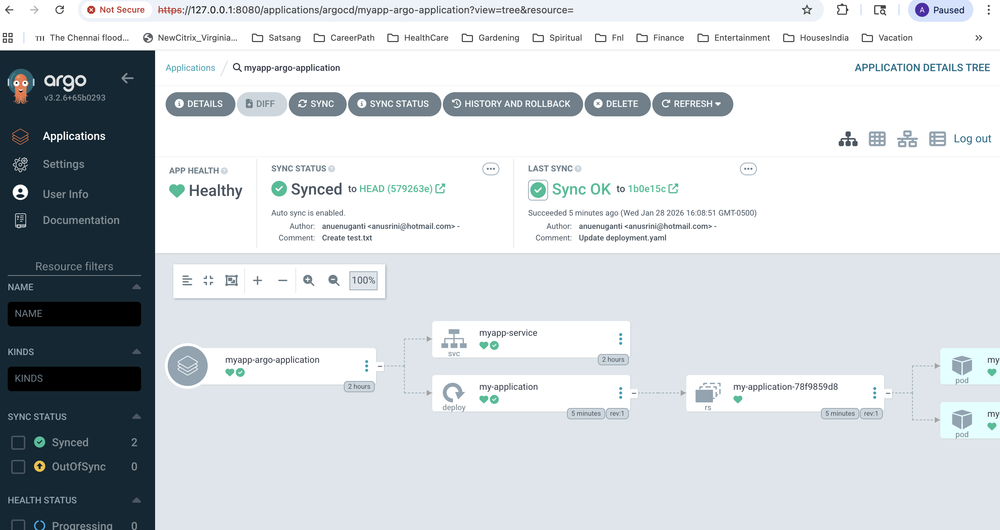

## ArgoCD - Why is it a preferred Continous Deployment tool for Kubernetes containerized applications?
Argo CD is referred to as a "GitOps CD" tool because it uses Git repositories as the single source of truth to define the desired application state and automates the process of matching that state to a live Kubernetes cluster.   
It is specifically designed to implement the GitOps methodology for Continuous Delivery (CD). 

Here is why it fits the definition:
- Git as Single Source of Truth: Argo CD tracks changes to applications defined in Git (YAML, Helm, Kustomize).
- Pull-Based Model: Instead of a CI system pushing changes, Argo CD runs inside Kubernetes, actively pulling configuration from Git to deploy applications, which enhances security.
- Drift Detection and Self-Healing: It constantly compares the live state in the cluster with the desired state in Git. If someone makes manual changes to the cluster (drift), Argo CD can automatically fix it to match the Git repository.
- Declarative Approach: It enforces a GitOps workflow where infrastructure and applications are defined declaratively, providing auditability and easy rollbacks. 
- Argo CD bridges the gap between Git and Kubernetes, making it a foundational tool for implementing GitOps. 
  ---
## Step 1: Install ArgoCD in K8s Cluster
Like other containerized applications, ArgoCD is available through Manifest files and you can deploy it in the Kubernetes cluster.
Create a namespace 'ArgoCD' and deploy the ArgoCD manifest files using commands described below.
Note: Here you are using your local Minikube cluster.
#### Commands

```bash
# install ArgoCD in k8s
kubectl create namespace argocd
kubectl apply -n argocd -f https://raw.githubusercontent.com/argoproj/argo-cd/stable/manifests/install.yaml

# access ArgoCD UI
kubectl get svc -n argocd
kubectl port-forward svc/argocd-server 8080:443 -n argocd

#Browse 127.0.0.1:8080, you may see security warning, click on 'Advanced' and 'Proceed to 127.0.0.1'

# login with 'admin' user and below token (as in documentation):
kubectl -n argocd get secret argocd-initial-admin-secret -o jsonpath="{.data.password}" | base64 --decode && echo

# you can change and delete init password if you want to.


```
## Step 2: Configure ArgoCD with Custom Resource file
Note: Kubernetes comes with built in resources such as deployments, pods and services and CRD allows users to extend the Kubernetes API by creating new object types and thus allowing 
the use of external software more affectively by integrating new custom objects as Kubernetes components inside the cluster.
Similarly ArgoCD comes with Custom Resource definition that is created automatically when you install ArgoCD, and you can create 

You need to create an object of kind 'Application' using the CRD template and define the values(Sourcee git repo, destination cluster/s, config values etc.)
Please see the below file and check the inline comments for details.
```
apiVersion: argoproj.io/v1alpha1
kind: Application
metadata:
  name: myapp-argo-application
  namespace: argocd
spec:
  project: default

  source:
    repoURL: https://github.com/anuenuganti/argocd-gitops.git      #source git repo url
    targetRevision: HEAD
    path: dev
  destination: 
    server: https://kubernetes.default.svc         #destination K8s cluster url, here: we are deploying the application to the same cluster where ArgoCD is installed.
    namespace: myapp

  syncPolicy:
    syncOptions:
    - CreateNamespace=true        #If the namespace specified in destination cluster is not already there, creates it.

    automated:
      selfHeal: true              #If a change is accidentally made to the cluster by running Kubectl commands, ArgoCD restores the status back to match the git Repo
      prune: true                 #If a resource or a manifest file is deleted from the repo, ArgoCD deletes it from the cluster
```
Before you apply the Custom resource file, create container registry credentials(DockerHub secret) in the namespace in which the your container application will be created using the command:
```
kubectl create secret docker-registry dockerhub-secret --docker-username=xxxxxxxx --docker-password=xxxxxxx -n myapp
#secret/dockerhub-secret created    //secret gets created in the myapp namespace
```
Once the secret is created, make sure to add the secret name to the manifest file(deployment.yaml) in your git repo using imagePullSecrets tag
```yml
spec:
      imagePullSecrets:
      - name: dockerhub-secret
      containers:
      - name: myapp
        image: anupama/java-maven-app:1.1.13-
```
Once you have created the dockerhub secret in the cluster and added it to the manifest file, apply the custom resource file using the following command:
This should take care of triggerring the ArgoCD to apply the manifest files in the Git repo to the cluster
```
kubectl apply -f Application.yaml
```
Check the ArgoCD UI ->Applications tab, and you should see the application getting deployed in cluster.
You can click on the application, and it will show the 'deployment, replicaset and the pods. You can click on each of this component and see the details such as name, version, logs etc.
You will also see the status manifest. You can delete pods or deployments too from here.

## Step 3: Test the ArgoCD action by updating Manifest files in the Git Repo
1. Change version of the app in the deployment Manifest file in Git repo and you will notice that ArgoCD syncs and updates the new version.
2. Change the app name in the deployment file in the git repo and you will that it gets updated in the cluster
3. Delete a resource in the Git repo and it will get deleted in the cluster
4. Run a kubectl command from your local machine and update/increase the replica count in the app deployment, you should see that it gets updated in the cluster, but again ArgoCD syncs with the Gitrepo and updates the replica count to match the value defined in the Git repo manifest file.
```
kubectl edit deployment myapp -n myapp
#update replica count and save the changes
#Verify the ArgoCD UI and you should see that it gets updated initially and then restored back to the count defined in manifest file in repo.
```


</br>

#### Links

* Install ArgoCD: [https://argo-cd.readthedocs.io/en/stable/getting_started/#1-install-argo-cd](https://argo-cd.readthedocs.io/en/stable/getting_started/#1-install-argo-cd)

* Login to ArgoCD: [https://argo-cd.readthedocs.io/en/stable/getting_started/#4-login-using-the-cli](https://argo-cd.readthedocs.io/en/stable/getting_started/#4-login-using-the-cli)

* ArgoCD Configuration: [https://argo-cd.readthedocs.io/en/stable/operator-manual/declarative-setup/](https://argo-cd.readthedocs.io/en/stable/operator-manual/declarative-setup/)


